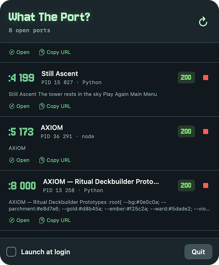

<p align="center">
  
</p>

# What The Port?

A tiny macOS menu bar app for answering the classic developer question:

> Wait, what is running on that port?

What The Port? watches local HTTP servers on your Mac, shows what it finds, and lets you stop the ones you no longer need. It lives in the macOS menu bar, where all good tiny utilities go to avoid making a scene.

<p align="center">
  
</p>

## Features

- Menu bar only, no Dock icon.
- Finds local TCP listeners and checks which ones respond over HTTP.
- Shows port, PID, process name, HTTP status, page title, and a short content preview.
- Opens or copies local server URLs.
- Stops individual server processes.
- Optional launch at login.
- Pixel-terminal interface with a custom app icon and menu bar icon.
- Native Swift/AppKit/SwiftUI app. No Electron and no webview wrapper.

## Requirements

- macOS 13 or newer.
- Xcode command line tools or Xcode.
- Swift 5.9 or newer.

## Build

```sh
swift build
```

## Run From Source

```sh
swift run WhatThePort
```

## Package The App

```sh
make package
```

The packaged app will be created at:

```text
outputs/What The Port?.app
```

You can run it from there, or move it to `/Applications` for normal daily use.

Packaging also generates `AppIcon.icns` from `assets/Logo.png` and bundles the menu bar icon assets from `assets/Icon.png`, `assets/Icon@2x.png`, and `assets/Icon@3x.png`.

## Install

For personal use:

1. Build/package the app.
2. Move `What The Port?.app` to `/Applications`.
3. Launch it.
4. Enable `Launch at login` from the app menu if you want it to start automatically.

## Gatekeeper Note

This project is currently not notarized. If you download a release build, macOS may block the first launch because the app is not signed with an Apple Developer ID certificate.

To open it anyway:

1. Right-click `What The Port?.app`.
2. Choose `Open`.
3. Confirm that yes, you really do want to know what the port is.

You can also build it yourself from source.

## How It Works

The app uses `lsof` to find local TCP listeners, probes `http://127.0.0.1:<port>`, and displays listeners that respond like HTTP servers. Stopping a server sends `SIGTERM` first, then `SIGKILL` if the process is still alive shortly after.

## Safety

Stopping a process is intentionally direct. What The Port? does not know whether your server is a throwaway dev server or an important local service. Check the PID/process name before stopping.

## Development

```sh
make build
make run
make package
```

## License

MIT

## Third-Party Licenses

The bundled Jersey 10 font is from Google Fonts and is licensed under the SIL Open Font License 1.1. See `Sources/WhatThePort/Resources/Jersey10-OFL.txt`.
